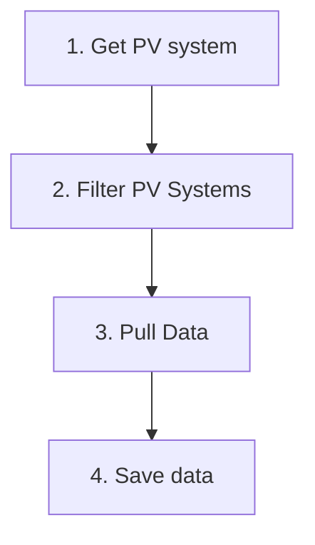
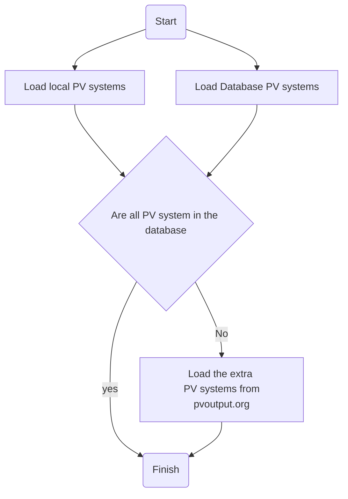
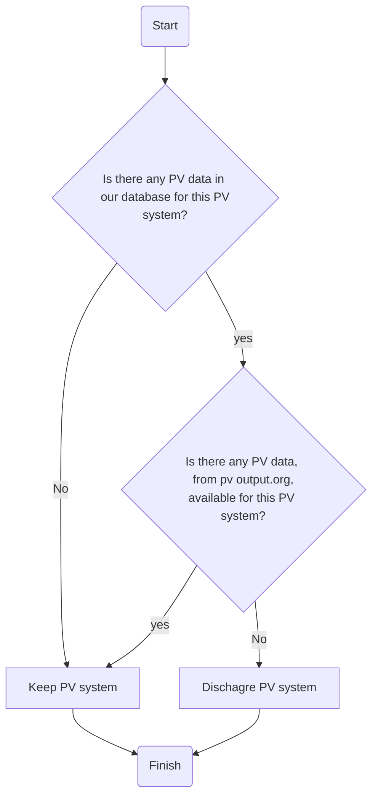
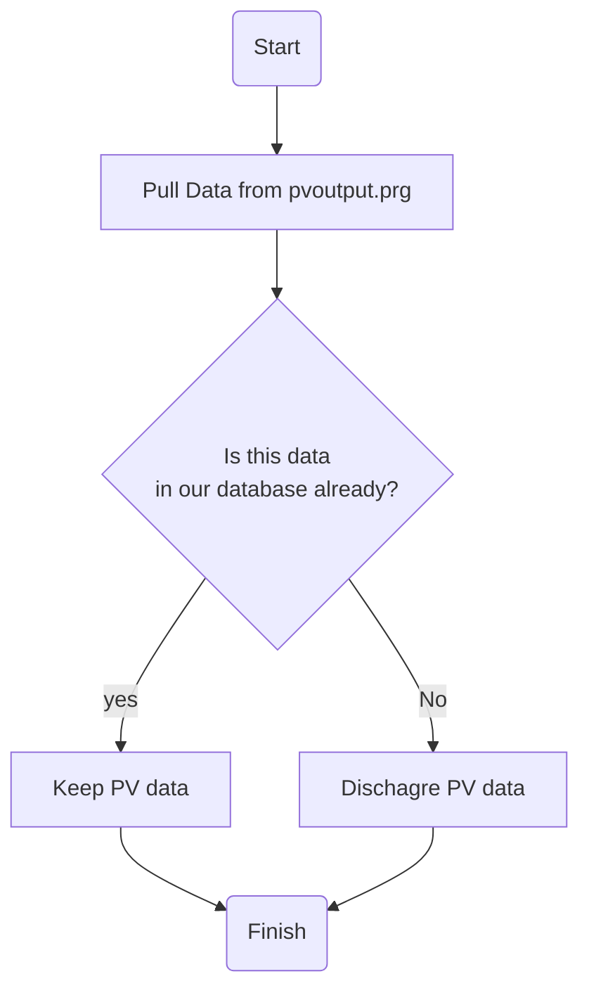

# Live 

This application pull live data from PV output.org and stores it in our own database

The app has the following high-level strucuture 

1. Get PV System

2. Filter PV Systems

3. Pull Data
